  

  
  

## 👋 Hi, I'm Tirth

I'm a Computer Science student at the **University of Regina**, looking for a co-op / internship. I'm genuinely curious about security, mostly **blue team** and **cloud security**, and I learn by building small labs and seeing what breaks.

## 🛡️ What I'm learning

- **Security monitoring:** SIEM, log analysis, alerting
- **Cloud security:** AWS logging and visibility with CloudTrail
- **Threat intel basics:** IP and domain reputation lookups

## 🚀 Projects

| Project | What it does | Stack |
|---|---|---|
| Wazuh SIEM Homelab | Home SOC lab detecting brute-force attempts | Wazuh |
| [AWS CloudTrail Security Monitoring](https://github.com/pateltirth128/aws-cloudtrail-security-monitoring) | Cloud activity logging and alerting on AWS | AWS CloudTrail |
| [Cerberus Threat Monitoring Dashboard](https://github.com/pateltirth128/cerberus-threat-monitoring-dashboard) | Dashboard for IP and domain reputation | JavaScript |
| [Flappy Bird](https://github.com/pateltirth128/flappy-bird) | Small game build | Python |

## 🧰 Tools

  
  
  
  

## 📫 Connect

  

