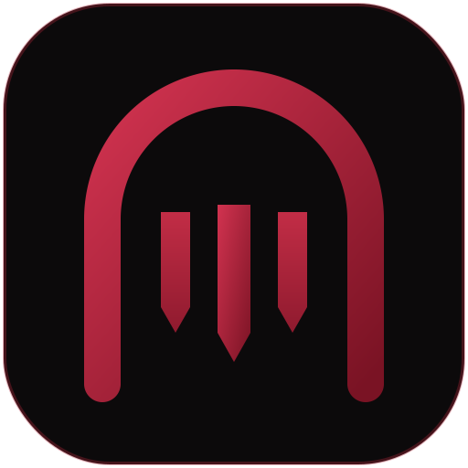

# Hey, I'm Tirth Patel 👋

**Computer Science student at the University of Regina**

---

## 🔭 What I'm focused on

- Looking for a co-op or internship with the help of U of R Co-op Program/ External too
- Learning new things

<b>👋 More about me</b>

 

I'm a Computer Science student at the University of Regina (2024 to 2028). I like learning by building: setting things up, breaking them on purpose, and seeing what the logs show. Right now I'm working on a Wazuh SIEM homelab.

---

## 🛠 Projects

<table>
  <tr>
    <td width="160" align="center">
      
    </td>
    <td>
      <h3><a href="https://github.com/pateltirth128/aws-cloudtrail-security-monitoring">AWS CloudTrail Security Monitoring</a></h3>
      <ul>
        <li>It watches my Amazon cloud account all the time, like a security camera.</li>
        <li>If someone sneaks in, gives themselves extra power, or tries to erase the records, it sends an alert right away.</li>
        <li>I tested it by pretending to break into my own account.</li>
      </ul>
      <b>Built with:</b> AWS CloudTrail
    </td>
  </tr>
  <tr></tr>
  <tr>
    <td width="160" align="center">
      
    </td>
    <td>
      <h3><a href="https://github.com/pateltirth128/cerberus-threat-monitoring-dashboard">Cerberus Threat Monitoring Dashboard</a></h3>
      <ul>
        <li>You type in a website or internet address.</li>
        <li>It checks 60+ "bad lists" to see if that address is known for trouble.</li>
        <li>It shows all the answers on one easy screen.</li>
      </ul>
      <b>Built with:</b> JavaScript
    </td>
  </tr>
  <tr></tr>
  <tr>
    <td width="160" align="center">
      
    </td>
    <td>
      <h3><a href="https://github.com/pateltirth128/flappy-bird">Flappy Bird: Left to Right (and Back)</a></h3>
      <ul>
        <li>It's my own version of the Flappy Bird game.</li>
        <li>Every 5 points, the bird turns around and flies the other way.</li>
        <li>I built it twice, in two different programming languages.</li>
      </ul>
      <b>Built with:</b> Python (pygame), C++ (raylib)
    </td>
  </tr>
</table>

---

## 🧰 Tools I use

  

---

## 🚀 Tools I want to work with

<h4 align="center">🛡 Things I Love </h4>

  
  
  
  
  
  
  
  

<h4 align="center">🕶 Privacy and anonymity</h4>

  
  
  
  
  

<h4 align="center">☁ Cloud security</h4>

  
  
  

<h4 align="center">🧪 Testing and vulnerabilities</h4>

  
  
  
  

<h4 align="center">💿 Bootable and security OS</h4>

  
  
  
  

<h4 align="center">🌐 Network</h4>

  
  
  

<h4 align="center">🔎 Forensics</h4>

  
  
  

---

## 🤝 Connect

  
  
  

