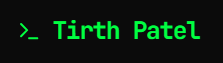

  

**Computer Science student at the University of Regina** 
Blue team · SOC · Cloud security

---

## 🔭 What I'm focused on

- Learning blue team operations and SOC work
- Building hands-on cloud security projects on AWS
- Looking for a co-op or internship through the U of R Co-op Program

<b>👋 More about me</b>

 

I'm a Computer Science student at the University of Regina (2024 to 2028). I like learning by building: setting things up, breaking them on purpose, and seeing what the logs show. Right now I'm working on a Wazuh SIEM homelab.

---

## 🛠 Projects

<table align="center">
  <tr>
    <td align="center" width="33%">
      <a href="https://github.com/pateltirth128/cerberus-threat-monitoring-dashboard">
         
        <b>Cerberus</b>
      </a>
       Threat monitoring dashboard
    </td>
    <td align="center" width="33%">
      <a href="https://github.com/pateltirth128/aws-cloudtrail-security-monitoring">
         
        <b>AWS CloudTrail</b>
      </a>
       Security monitoring and alerts
    </td>
    <td align="center" width="33%">
      <a href="https://github.com/pateltirth128/flappy-bird">
         
        <b>Flappy Bird</b>
      </a>
       Left to Right (and Back)
    </td>
  </tr>
</table>

<b>📂 Project details</b>

 

**Cerberus Threat Monitoring Dashboard**
Checks IPs, domains and servers against 60+ blacklists, with DNS, SSL, WHOIS and email security lookups.

**AWS CloudTrail Security Monitoring**
Real-time alerts for backdoor IAM accounts, privilege escalation and log tampering, tested with a simulated attack on my own AWS account.

**Flappy Bird: Left to Right (and Back)**
A Flappy Bird twist built in both Python (pygame) and C++ (raylib), where the bird turns around every 5 points.

---

## 🧰 Tools I use

  

---

## 📊 GitHub stats

  
  

---

## 🤝 Connect

  
  
  

